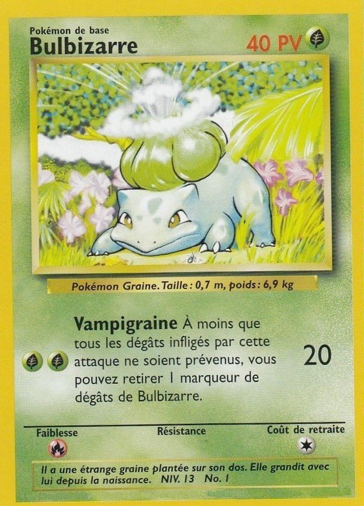
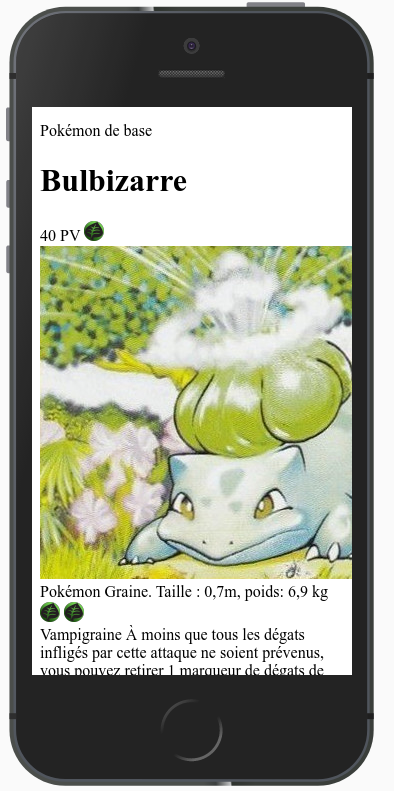
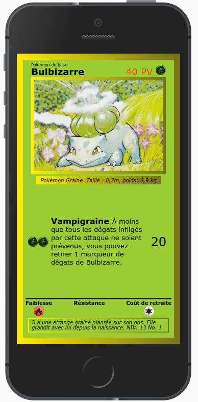

# TP — Flexbox + Vite

Pour se familiariser avec les différentes propriétés :
[Flexbox Froggy](https://flexboxfroggy.com/#fr)

Le but de l'exercice est de reproduire une célèbre carte à jouer en utilisant les propriétés flexbox. Voici le modèle :



## Étape 0 : Installation de l'environnement de développement

- Créer un fork de ce repository
- Cloner le projet grâce à GIT
- Ouvrir le projet dans votre éditeur (VSCode recommandé)

### Formattage automatique du code

- Installer le plugin _Prettier_ pour votre éditeur
- Dans les options (si vous utilisez VSCode) :
  - Cocher `Format on save`
  - Régler `Default formatter` sur `...prettier...`
- Vérifier le bon fonctionnement sur le fichier `index.html` (à la sauvegarde, le code mal formaté est-il reformaté ?)

### Installation de node

Node permet d'éxécuter du JavaScript sur votre machine (en dehors du navigateur). La majorité des outils de développement front sont basés sur node.

Suivez les [instructions pour installer Node](https://nodejs.org/fr/).

Pour vérifier l'installation correcte, ouvrez un terminal et tapez :

```
node -v
```

Vous devriez voir la version de node qui a été installée.


### Lancement de Vite

L'environnement de travail pour ce TP utilise [Vite](https://vitejs.dev/), un outil d'empaquetage moderne et rapide. Pour simplifier, il prend toutes vos ressources "brutes" (html, scss, images...) et se charge de tout compiler pour le développement en local ou le déploiement en production.

- Ouvrez un terminal depuis votre éditeur puis lancez l'installation des dépendances du projet :

```
npm install
```

*Note : `npm` est le gestionnaire de paquets de node. Il a été installé automatiquement avec ce dernier.*

- Lancez Vite en mode développement

```
npm run dev
```

Votre serveur local est maintenant disponible à l'URL fournie par Vite. Accedez-y : vous devez voir une page blanche.

## Étape 1 : Les fondations (HTML sauce BEM)

- Rappel BEM : [ici](https://www.alticreation.com/bem-pour-le-css/) (français) ou [là](https://css-tricks.com/bem-101/)
- Déterminer quels sont les blocs constituant la carte (environ 6, selon le choix de découpage), et leur donner un nom simple et représentatif de leur fonction.
- Écrire le HTML correspondant, sans CSS pour le moment.

Les images sont dans le dossier `src/img`.

Résultat approximatif à cette étape :



### Qualité du code

Pour améliorer la qualité de votre code...

- Vérifier que Prettier a bien fait son travail de formattage automatique
- Utiliser le [validateur du W3C](https://validator.w3.org/#validate_by_input) pour éliminer les "warnings" et les "errors" (vous pouvez ignorez les "infos")
- Utiliser l'extension axe DevTools (disponible sur [Chrome](https://chrome.google.com/webstore/detail/axe-devtools-web-accessib/lhdoppojpmngadmnindnejefpokejbdd) et [Edge](https://microsoftedge.microsoft.com/addons/detail/axe-devtools-web-access/kcenlimkmjjkdfcaleembgmldmnnlfkn)) pour vérifier l'absence d'erreurs d'accessibilité

### Avant de passer à la suite

- Solliciter une vérification de ma part ou continuer si tout est clair pour vous !

- Effectuer un commit avant de passer à la suite. Rappel de la procédure :

```
git add monfichier.html
git commit -m "Un message descriptif de mes modifications"
git push
```

## Étape 2 : Styling SASS

SASS et les fichiers .scss vont nous permettre d'écrire notre CSS plus efficacement.

Ajouter un fichier `src/styles/styles.scss` à votre projet et l'importer à partir de `index.html`. Vite s'occupera de la transformation en CSS natif.

### Reset CSS

- Ajouter un fichier `src/styles/vendors/reset.scss` à votre projet contenant le [reset CSS classique](https://meyerweb.com/eric/tools/css/reset/), sans l'importer dans l'index.html (seul le fichier principal est importé).

- Dans le fichier `styles.scss`, utiliser un import SASS pour importer le fichier `reset.scss` :

```scss
@import 'vendors/reset.scss';
```

Cela doit avoir pour effet de faire disparaître les styles par défaut du navigateur (par exemple, le titre "Bulbizarre" ne doit plus être mis automatiquement en gras).

### Styles de base

Dans vos projets, toujours inclure les deux règles CSS suivantes (rappel sur [box-sizing](https://developer.mozilla.org/fr/docs/Web/CSS/box-sizing)) :

```css
* {
  box-sizing: border-box;
}

img {
  max-width: 100%;
}
```

### Propriétés "interdites" (car inutiles) pour cet exercice :

- `width`
- `height`
- `float`
- `position`
- `transform`

### Reproduction du design

Votre but est maintenant de reproduire la carte sur un écran de type iPhone5 (`320px * 568px`). Il vous appartient de pousser la ressemblance avec l'original au maximum, mais voici un exemple de rendu tout à fait correct :



- En accord avec la convention BEM :
  - Créez un fichier .scss par bloc
  - Utilisez quasiment exclusivement des sélecteurs de classe
  - Évitez au maximum les imbrications. SASS sera utile, mais surtout pour la suite.

### Avant de passer à la suite

- Vérifier de nouveau l'accessibilité avec l'extension `Axe`. Si nécessaire, vous pouvez modifier les couleurs de la carte originale.
- Solliciter une vérification de ma part ou continuer si tout est clair pour vous !
- `git commit`

## Étape 3 : Mode paysage

On souhaite adapter la carte à un mobile de la même taille en mode paysage (`568px * 320px`), autrement dit lorsque la largeur est plus grande que la hauteur.
Pour ce faire, vous pouvez ajouter une mixin SASS au début de votre fichier principal (ou dans un fichier séparé) :

```scss
@mixin landscape {
  @media (orientation: landscape) {
    @content;
  }
}
```

Grâce à cette mixin, vous pouvez écrire :

```scss
.selector {
  color: red;

  @include landscape {
    color: blue;
  }
}
```

Utiliser une mixin permet d'inclure les variations au plus proche du sélecteur de base, au lieu de tout écrire en fin de fichier, ce qui rend le code plus maintenable / lisible.

Voici le nouvel objectif à atteindre :


### Avant de passer à la suite

- Vérifier de nouveau l'accessibilité avec l'extension `Axe`. Si nécessaire, vous pouvez modifier les couleurs de la carte originale.
- Solliciter une vérification de ma part ou continuer si tout est clair pour vous !
- `git commit`

# Ressources

- En cas de besoin : [Exercices HTML/CSS](https://htmlcss2018.netlify.com/)
- [Méthode BEM](http://getbem.com/introduction/)

## Flexbox

- Reférence : [CSS Tricks Guide](https://css-tricks.com/snippets/css/a-guide-to-flexbox/)
- Outil : [Flexulator, calculateur de flexbox](https://www.flexulator.com/)
- Entraînement : [Flexbox Froggy](https://flexboxfroggy.com/#fr)
